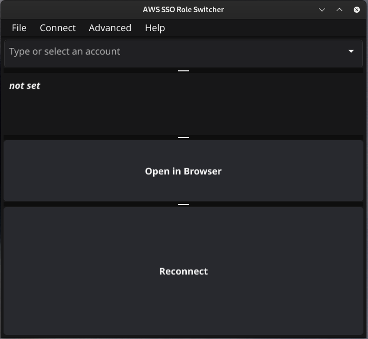

# AWSRoleSwitcher



###### Disclaimer

Note that AWSSSORoleSwitcher has no association with Amazon Web Services or Amazon in general. Name contains AWS to define which cloud provider this tool works with.

## Purpose
### Why
AWS identity center's app for switching is clumsy to work with, especially when multiple accounts need to be opened. This tool will allow you to easily login to multiple AWS accounts with different browser profies. Default CLI profile is also set to account you have choosen

## Requirments for this app
* AWS CLI and you need to configure something to credential file (AWS configure command) as Roleswitcher overwrites default profile each time account is selected
* Linux/Mac/Windows
* Any browser should be fine, preferably one that allows to have multiple profiles (ie chrome,firefox)

## Installation

### Easiest option
Just download release file for your operating system from github. On Linux side you have to set execution permissions to file. From terminal this can be done with:
```bash
chmod +x awsssoroleswitcher
```
Most operating systems support this functionality from right clicking file
#### Mac only
Since this project does not have developer ID for mac, in addition to previous step with chmod +x, when user uses app first time he is required to approve usage through security and privacy settings. After first launch attempt there should be notification in security and privacy settings which user has to approve before being able to launch this app.
#### Windows
Windows binary should run with out any pre-required steps

# How to use
start application. 
Pick Connect then AWS-SSO. Set identity center URL, region where SSO is present and which ever region you want your browser defaulting to. Also set alias as it will make it easier to search logs for your actions. Then press connect.
Application should now fetch all the accounts you are allowed to log in.
Pick one from list (you can also write to search).
Once you pick one it will automatically loginto that account and set it as your default AWS account on credentials file.
If you need browser session, press Open in browser.

## Override accountnames
You can also copy & paste from exampleconfiguration folder example file (note that it does not have .txt extension) for overriding accountnames. File needs to be placed in same folder as aws credential file. This is helpful when you want to alter profile name for account key dumps. In the  configuration file accountID id is in brackers and AccountName under it is the name you want account to have instead of the default value. You also have to define AccountRole as this will be used to identify unique credentials as some might have multiple roles on same account.

## Dump all profiles to credential file
Under advanced dropdown you can find option to dump all keys to credential files. There are multiple reasons when you need to have keys in file, such as CDK pipeline deployment phase or 3rd party tool like steampipe.


